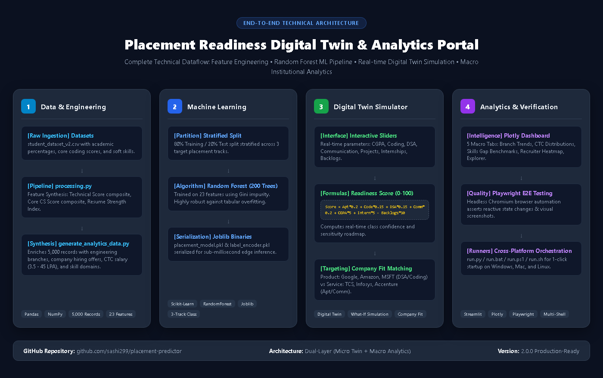

# Placement Readiness Digital Twin & Analytics Portal
## End-to-End Technical Workflow & Architecture

---

## 1. Data & Feature Engineering Layer
- **Input Datasets**: `student_dataset_v2.csv` (Raw features) -> `student_dataset_v3.csv` (23 Engineered features).
- **Processing Engine** (`processing.py`):
  - **Technical Score Composite**: $\frac{\text{Coding} + \text{DSA} + \text{SQL} + \text{Python}}{4}$
  - **Core CS Score Composite**: $\frac{\text{DBMS} + \text{OS} + \text{OOPs}}{3}$
  - **Resume Strength Index**: $(\text{Projects} \times 2) + \text{Certs} + (\text{Internships} \times 3) + \text{Hackathons}$
- **Analytics Data Synthesis** (`generate_analytics_data.py`):
  - Correlates student technical profiles with 6 Engineering Branches (CSE, IT, ECE, AI/DS, EEE, ME).
  - Assigns hiring offers (Tier-1 Product vs. IT Services) and continuous salary packages (3.5 to 45.0 LPA) across 5,000 student records in `student_placement_analytics.csv`.

---

## 2. Machine Learning Training Pipeline (`machine_learning.py`)
- **Model Architecture**: Random Forest Classifier with 200 Decision Trees.
- **Dataset Partition**: Stratified 80/20 train-test split across 3 target classes:
  - `Product_Ready`
  - `Service_Ready`
  - `Not_Placed`
- **Model Serialization**: `joblib.dump()` creates `placement_model.pkl` and `label_encoder.pkl` for low-latency (<5ms) edge inference.

---

## 3. Real-Time Digital Twin Simulator (`app.py`)
- **Interactive UI**: Reactive sliders for CGPA, Coding Score, DSA Score, Communication, Internships, Projects, and Active Backlogs.
- **Readiness Formula**:
  $$\text{Readiness Score} = \min(100, \max(0, [\text{Aptitude} \times 0.20 + \text{Coding} \times 0.15 + \text{DSA} \times 0.15 + \text{Comm} \times 0.20 + \text{CGPA} \times 5.0 + \text{Internships} \times 5.0 - \text{Backlogs} \times 10.0]))$$
- **Targeted Company Fit**:
  - **Google / Amazon / MSFT**: Evaluates algorithmic strength, DSA weight (40-50%), coding (35-40%), and quality project count.
  - **TCS / Infosys / Accenture**: Evaluates aptitude (30-40%), communication (30-40%), coding fundamentals (20%), and academic CGPA.

---

## 4. Placement Analytics Dashboard (`analytics_dashboard.py`)
- **Visualization Engine**: Plotly Express & Plotly Graph Objects integrated into 7 responsive tabs:
  1. **Branch-wise Trends**: Placement percentage comparison and placed vs. unplaced headcount distribution.
  2. **Salary Statistics**: Continuous CTC histogram, marginal box plots, salary tier donut chart, and CGPA vs. package bubble scatter.
  3. **Skills Intelligence**: Primary skill domain placement rates and placed vs. unplaced cohort benchmark gap analysis.
  4. **Recruiter Insights**: Total hires per company, average CTC offered, and cross-branch hiring density heatmap.
  5. **Skill-Gap Recommender**: Student-level competency gap analysis against recruiter minimum cutoffs (`recruiter_requirements.csv`), color-coded deficit charts, prioritized shortfalls, and best-fit company rankings.
  6. **Alumni Outcome Tracker**: 1–5 year post-placement career analytics (`alumni_outcomes.csv`), salary growth curves, starting vs current CTC bubble scatter, promotions, and domain/employer mobility.
  7. **Data Explorer**: Real-time filtered student records table and one-click CSV dataset export.

---

## 5. Quality Assurance & Orchestration
- **Automated Verification**: End-to-end tests driven by Playwright (`test_analytics_playwright.py`) running headless Chromium against all UI components.
- **Cross-Platform Runners**:
  - `run.bat` (Windows Command Prompt)
  - `run.ps1` (Windows PowerShell)
  - `run.py` (Universal Python CLI)
  - `run.sh` (Linux / macOS Bash)
